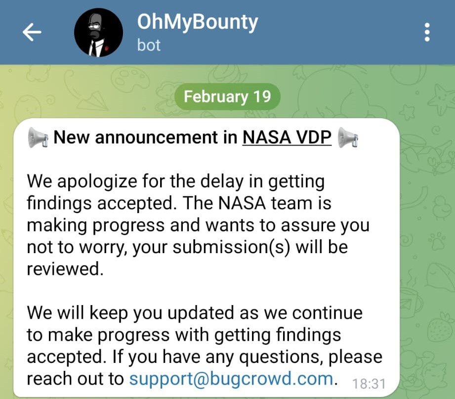
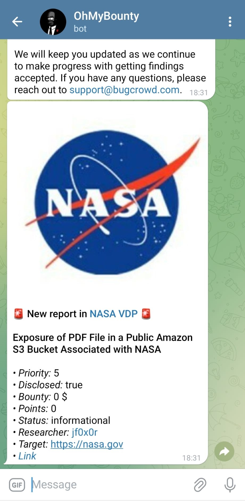

# OhMyBounty

**OhMyBounty** is a tool designed to monitor changes in **Bugcrowd** Bug Bounty programs, notifying you about new **announcements** (like scope changes) and reports in **CrowdStream**. It helps you stay ahead of new vulnerabilities before others find them.

## Features

- **Announcement Monitoring**: Detects changes in program announcements (e.g., scope increases).
- **CrowdStream Monitoring**: Sends notifications about new reports in CrowdStream.
- **Notifications**: Sends real-time alerts via **Telegram** and **Discord**.

## Installation

### Requirements

- Node.js (v20 or higher)
- pnpm / npm / yarn

### Steps

1. Clone the repository:

    ```bash
    git clone https://github.com/kapeka0/OhMyBounty.git
    cd OhMyBounty
    ```

2. Install the dependencies:

    Using **npm**:

    ```bash
    npm install
    ```

    Or using **pnpm**:

    ```bash
    pnpm install
    ```

## Configuration

Configure a `config.json` file:

```json
{
  "engagements": [  // Array of programs to monitor
    {
      "name": "NASA VDP",  // Name of the program (can be any custom name)
      "engagementCode": "nasa-vdp",  // The engagement code (part of the URL for the program) 
      // ➡️ https://bugcrowd.com/engagements/nasa-vdp
      "enabled": true,  // Set to true if you want to monitor this program
      "platform": "bugcrowd",  // Platform name, for a future, ignore it

      "announcements": {
        "enabled": true,  // Set to true if you want to monitor announcements (like scope changes, etc.)
        "lastAnnouncementId": null  // Leave this as null; it's used internally to track the last update
      },

      "crowdStream": {
        "enabled": true,  // Set to true if you want to monitor the CrowdStream feed
        "minimumPriorityNumber": 5,  // Minimum priority for the reports to notify about
        "filterBy": ["disclosures", "accepted"],  // Filters for the report status (must have at least one value)
        // disclosures: Just disclosed reports
        // accepted: Just not disclosed reports
        
        "lastReportId": null  // Leave this as null; it's used internally to track the last update
      }
    }
  ],

  "cronInterval": "* * * * *",  // Cron schedule for script execution (this runs every minute by default)

  "notifications": {
    "telegram": true,  // Set to true if you want to receive Telegram notifications
    "discord": true  // Set to true if you want to receive Discord notifications
  }
}
```

### Notifications

Create a `.env` file with the following variables:

```
# Telegram
TELEGRAM_BOT_TOKEN=your_telegram_token
TELEGRAM_CHAT_ID=your_telegram_chat_id

# Discord
DISCORD_WEBHOOK_URL=your_discord_webhook_url
```

## Running the Tool

### Running with Node.js (No Background Process Management):

Since **OhMyBounty** uses **node-cron** for scheduling tasks, you can run the script simply by executing:

```bash
node index.js
```

This will start the monitoring process, and it will run according to the intervals specified in the `cronInterval` field of the `config.json` file.

If you want to run it in the background, you can use `nohup` to ensure it keeps running even after you close the terminal:

```bash
nohup node index.js > /dev/null 2>&1 &
```

### Recommended Method: Using PM2

The recommended way to run **OhMyBounty** is with **PM2**, as it will ensure that the script continues running even if it crashes. PM2 will automatically restart the script if it stops unexpectedly.

To use **PM2**:

1. Install PM2 globally:

    ```bash
    sudo npm install pm2@latest -g
    ```

2. Start the script with PM2:

    ```bash
    pm2 start index.js
    ```

3. (Optional) You can also save the process list so that PM2 will automatically restart your script on system reboot:

    ```bash
    pm2 save
    pm2 startup
    ```

PM2 provides better process management and reliability, making it the recommended choice for running **OhMyBounty**.
 
## Example
### Telegram



### Discord
> [!NOTE]  
> See that the colors reflect the priority🫠


