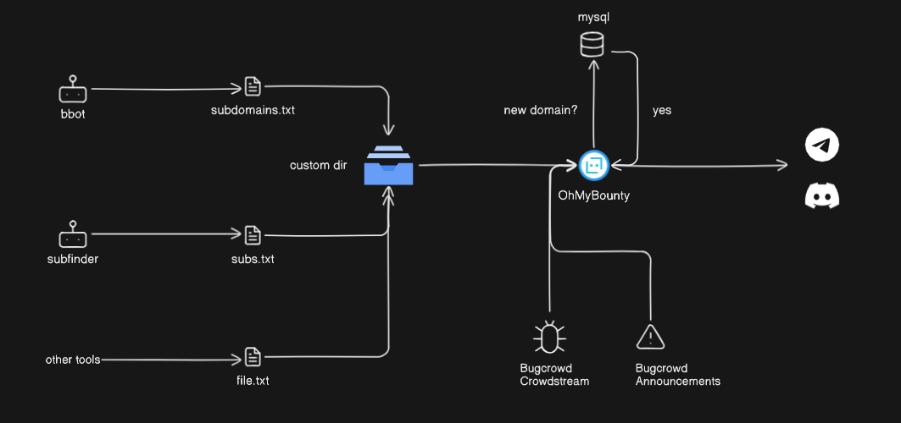

<a href="https://coff.ee/kapeka" target="_blank"></a>
# OhMyBounty🍩

**OhMyBounty** is a tool designed to help security researchers stay ahead of the curve by monitoring  Bug Bounty programs (for now just Bugcrowd ones). It notifies users about new **announcements** (like scope changes) and reports in **CrowdStream**. Additionally, it helps monitor subdomain discovery by keeping track of newly found subdomains of your favorite tools, alerting you when new subdomains appear that are not yet in their database.



Here’s a breakdown of the key features:

- **Announcement Monitoring**: Automatically checks for any new program announcements on Bugcrowd (e.g., scope changes, new guidelines) and notifies you in real-time.
- **CrowdStream Monitoring**: Keeps track of new reports in Bugcrowd's CrowdStream feed and sends alerts based on customizable filter criteria (e.g., only reports above a certain priority).
- **Subdomain Monitoring**: Watches for `.txt` files containing subdomains generated by your tools. These files are then parsed and stored in a MySQL database, and new subdomains trigger an alert if they are not already in the database.
- **Real-time Notifications**: Notifications are sent through **Telegram** and **Discord**, allowing you to stay informed wherever you are.
- **Customizable Configuration**: Tailor your monitoring preferences for different Bugcrowd programs and subdomain directories through a JSON configuration file.
- **Screenshots of Active Subdomains**: Optionally takes screenshots of active subdomains and includes them in notifications.


## Installation

### Requirements

- Node.js (v20 or higher)
- pnpm / npm / yarn

### Steps

#### 1. Clone the repository:

```bash
git clone https://github.com/kapeka0/OhMyBounty.git
cd OhMyBounty
```

#### 2. Linux/RaspberryOS

Due to some errors executing Puppeteer on Unix OS, follow this guide to avoid issues.  
Execute the following commands:

```bash
cd ./OhMyBounty
sudo apt install chromium-browser chromium-codecs-ffmpeg
sudo apt-get install npm
npm install puppeteer-core@v1.11.0
npm install
```

#### 3. Windows

```bash
cd ./OhMyBounty
npm install
```

 Delete the following line from `index.js`:
  ```javascript
  executablePath: "/usr/bin/chromium-browser", // Delete this in Windows OS.
  ```
This line is included to avoid errors in Unix systems.

---

## Configuration

Configure your `config.json` file to specify which Bugcrowd programs and features to monitor. Here's an example configuration:

```json
{
  "engagements": [  // Array of programs to monitor
    {
      "name": "NASA VDP",  // Name of the program (can be any custom name)

      "engagementCode": "nasa-vdp",  // The engagement code (part of the URL for the program) 
      // ➡️ https://bugcrowd.com/engagements/nasa-vdp

      "enabled": true,  // Set to true if you want to monitor this program

      "platform": "bugcrowd",  // Platform name, for a future, ignore it

      "announcements": {
        "enabled": true,  // Set to true if you want to monitor announcements (like scope changes, etc.)

        "lastAnnouncementId": null  // Leave this as null; it's used internally to track the last update
      },

      "crowdStream": {
        "enabled": true,  // Set to true if you want to monitor the CrowdStream feed

        "minimumPriorityNumber": 5,  // Minimum priority for the reports to notify about

        "filterBy": ["disclosures", "accepted"],  // Filters for the report status (must have at least one value)
        // disclosures: Just disclosed reports
        // accepted: Just not disclosed reports
        
        "lastReportId": null  // Leave this as null; it's used internally to track the last update
      },
        "subdomainMonitor": { 
        "enabled": true, // Set to true if you want to monitor for output subdomains.txt files

        "storeMode": true, // Just store subdomains in DB (for new runing with empty DB)

        "subdomainsDirectory": "/home/user/kpk0/bb/nasa-vdp/scans", // The dir where your tools will output the .txt files, NOT recursively, just one level

        "screenshotEnabled": true, // Getting web preview image on messages or not,
        
        "hideCodes": [404, 403, 500] // Blacklist status codes
      }
    }
  ],

  "cronInterval": "* * * * *",  // Cron schedule for script execution (this runs every minute by default)

  "notifications": {
    "telegram": true,  // Set to true if you want to receive Telegram notifications

    "discord": true  // Set to true if you want to receive Discord notifications
  }
}
```

### Environment Variables

Create a `.env` file with these variables:

```
# Telegram
TELEGRAM_BOT_TOKEN=your_telegram_token
TELEGRAM_CHAT_ID=your_telegram_chat_id

# Discord
DISCORD_WEBHOOK_URL=your_discord_webhook_url

# MySQL
MYSQL_HOST=localhost
MYSQL_PORT=3306
MYSQL_USER=root
MYSQL_PASSWORD=
MYSQL_DATABASE=omb
```
> [!WARNING]  
> Ensure that the database exists, the tables are created by OMB.
---

## **Running the Tool**

### **Running with Node.js (Without Background Process Management)**

To start the tool manually using **Node.js**, run:

```bash
node index.js
```

For background execution (e.g., on a server), use `nohup` to keep it running after logout:

```bash
nohup node index.js > /dev/null 2>&1 &
```

---

### **Running with PM2 (Recommended)**

To ensure the tool runs continuously and restarts automatically if it crashes, use **PM2**.

#### **1. Install PM2 globally**
```bash
sudo npm install pm2@latest -g
```

#### **2. Start the script with PM2**
```bash
pm2 start index.js
```

#### **3. Enable automatic restart on system reboot**
```bash
pm2 save
pm2 startup
```

#### **4. Enable automatic log rotation**
```bash
pm2 install pm2-logrotate
```

---

### **Running Subdomain Finder Tools with `cron` (Recommended Approach)**

To continuously run subdomain discovery tools, schedule them using **UNIX `cron` jobs**.

#### **Example: Running `subfinder` every 5 minutes**
```bash
*/5 * * * * subfinder -dL targets.txt -silent | sponge /path/to/programDir
```

#### **Why use `sponge`?**
`OMB` processes files based on the cron interval set in `config.json`. If a tool is still writing to a file when `OMB` processes it, there is a risk of data loss. Using `sponge` ensures `STDIN` is fully received before writing the output.

> [!WARNING] 
> `OhMyBounty (OMB)` **deletes files after processing** to prevent duplicate processing. Ensure your workflow accounts for this.

> [!IMPORTANT]
> If you're starting with an empty database, set storeMode to true in config.json and let it run for a full day. This prevents excessive notifications when new subdomains are found.
---

## **Example Notifications**

### **Telegram Notifications**


### **Discord Notifications**


<p style="text-align: center;" align="center"> Happy Hacking👨‍💻</p>

 

 

 
