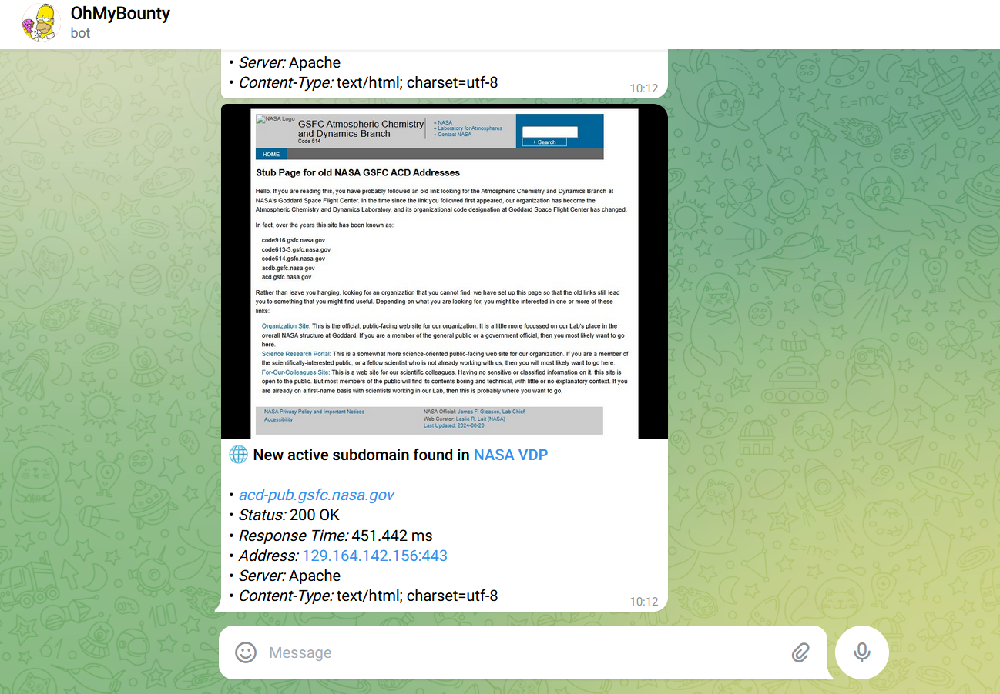
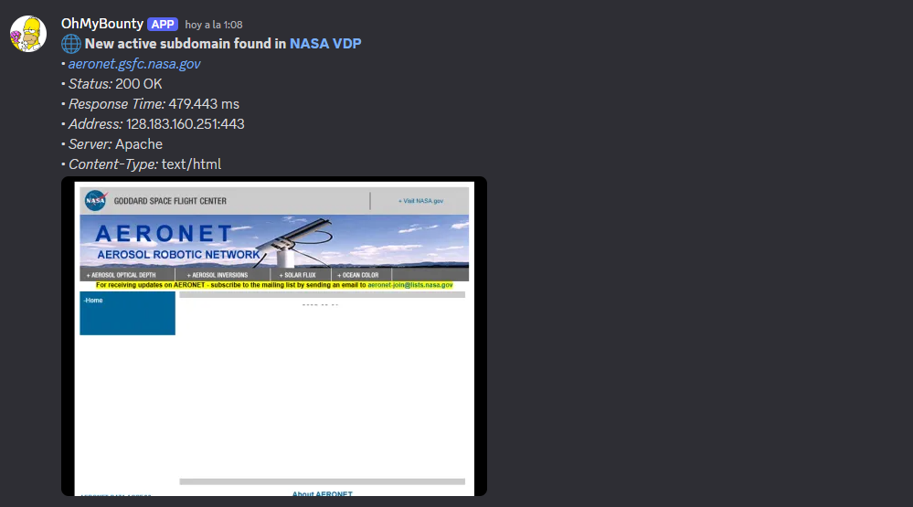

# OhMyBounty🍩

**OhMyBounty** is a tool designed to help security researchers stay ahead of the curve by monitoring  Bug Bounty programs (for now just Bugcrowd ones). It notifies users about new **announcements** (like scope changes) and reports in **CrowdStream**. Additionally, it helps monitor subdomain discovery by keeping track of newly found subdomains of your favorite tools, alerting you when new subdomains appear that are not yet in their database.

Here’s a breakdown of the key features:

- **Announcement Monitoring**: Automatically checks for any new program announcements on Bugcrowd (e.g., scope changes, new guidelines) and notifies you in real-time.
- **CrowdStream Monitoring**: Keeps track of new reports in Bugcrowd's CrowdStream feed and sends alerts based on customizable filter criteria (e.g., only reports above a certain priority).
- **Subdomain Monitoring**: Watches for `.txt` files containing subdomains generated by your tools. These files are then parsed and stored in a MySQL database, and new subdomains trigger an alert if they are not already in the database.
- **Real-time Notifications**: Notifications are sent through **Telegram** and **Discord**, allowing you to stay informed wherever you are.
- **Customizable Configuration**: Tailor your monitoring preferences for different Bugcrowd programs and subdomain directories through a JSON configuration file.
- **Screenshots of Active Subdomains**: Optionally takes screenshots of active subdomains and includes them in notifications.

> **Important:**  
> OhMyBounty will notify you when new subdomains are discovered that are not already in the database. Ensure you allow the tool to run long enough with `storeMode` set to `true` to avoid an overload of notifications when starting with an empty database.

---

## Installation

### Requirements

- Node.js (v20 or higher)
- pnpm / npm / yarn

### Steps

1. Clone the repository:

    ```bash
    git clone https://github.com/kapeka0/OhMyBounty.git
    cd OhMyBounty
    ```

2. Install dependencies:

    Using **npm**:

    ```bash
    npm install
    ```

    Or using **pnpm**:

    ```bash
    pnpm install
    ```

---

## Configuration

Configure your `config.json` file to specify which Bugcrowd programs and features to monitor. Here's an example configuration:

```json
{
  "engagements": [  // Array of programs to monitor
    {
      "name": "NASA VDP",  // Name of the program (can be any custom name)

      "engagementCode": "nasa-vdp",  // The engagement code (part of the URL for the program) 
      // ➡️ https://bugcrowd.com/engagements/nasa-vdp

      "enabled": true,  // Set to true if you want to monitor this program

      "platform": "bugcrowd",  // Platform name, for a future, ignore it

      "announcements": {
        "enabled": true,  // Set to true if you want to monitor announcements (like scope changes, etc.)

        "lastAnnouncementId": null  // Leave this as null; it's used internally to track the last update
      },

      "crowdStream": {
        "enabled": true,  // Set to true if you want to monitor the CrowdStream feed

        "minimumPriorityNumber": 5,  // Minimum priority for the reports to notify about

        "filterBy": ["disclosures", "accepted"],  // Filters for the report status (must have at least one value)
        // disclosures: Just disclosed reports
        // accepted: Just not disclosed reports
        
        "lastReportId": null  // Leave this as null; it's used internally to track the last update
      },
        "subdomainMonitor": { 
        "enabled": true, // Set to true if you want to monitor for output subdomains.txt files

        "subdomainsDirectory": "/home/user/kpk0/bb/nasa-vdp/scans", // The dir where your tools will output the .txt files, NOT recursively, just one level

        "screenshotEnabled": true // Getting web preview image on messages or not
      }
    }
  ],

  "cronInterval": "* * * * *",  // Cron schedule for script execution (this runs every minute by default)

  "notifications": {
    "telegram": true,  // Set to true if you want to receive Telegram notifications

    "discord": true  // Set to true if you want to receive Discord notifications
  }
}
```

### Environment Variables

Create a `.env` file with these variables:

```
# Telegram
TELEGRAM_BOT_TOKEN=your_telegram_token
TELEGRAM_CHAT_ID=your_telegram_chat_id

# Discord
DISCORD_WEBHOOK_URL=your_discord_webhook_url

# MySQL
MYSQL_HOST=localhost
MYSQL_PORT=3306
MYSQL_USER=root
MYSQL_PASSWORD=
MYSQL_DATABASE=omb
```
> [!WARNING]  
> Ensure that the database exists, the tables are made by OMB.
---

## Running the Tool

### Running with Node.js (No Background Process Management)

To start the tool with **Node.js**, use the following command:

```bash
node index.js
```

For background execution (e.g., on a server), use `nohup`:

```bash
nohup node index.js > /dev/null 2>&1 &
```

### Running with PM2 (Recommended)

To ensure the tool runs continuously, even if it crashes, use **PM2**:

1. Install PM2 globally:

    ```bash
    sudo npm install pm2@latest -g
    ```

2. Start the script with PM2:

    ```bash
    pm2 start index.js
    ```

3. To have PM2 restart the script automatically on system reboot:

    ```bash
    pm2 save
    pm2 startup
    ```
4. Auto rotate logs just with one command:

    ```bash
    pm2 install pm2-logrotate
    ```

---

## Example Notifications

### Telegram Examples




### Discord Examples



---

 
